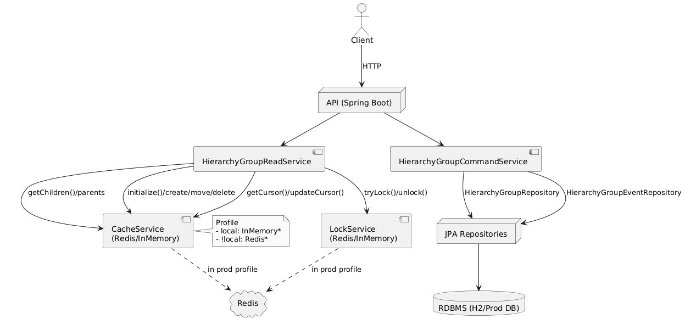
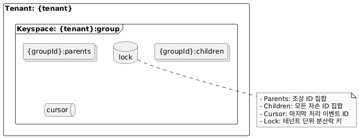
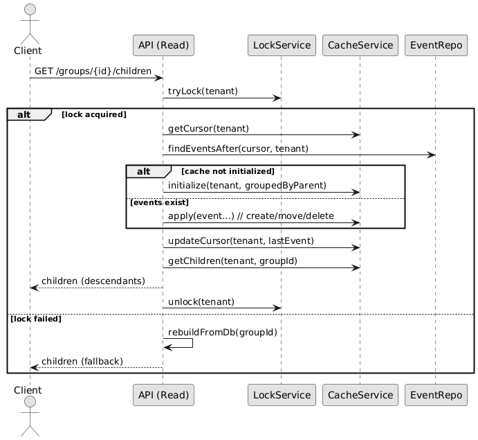

# 계층형 데이터 고성능 조회와 일관성 전략 교육자료

## 1) 접근 방식 비교: 재귀 vs 리빌드 vs 캐시
- **DB 재귀 조회**
  - 장점: 단순, 최신성 보장(DB 직조회)
  - 단점: N+1, 깊이에 비례한 지연, DB 부하 증가
  - 적합: 소규모/지연 허용/운영 단순화 우선
- **findAll() + 리빌드(메모리 트리)**
  - 장점: 소수 쿼리로 트리 구축 후 빠른 읽기
  - 단점: 전량 스캔 비용, 변경 동기화 어려움, 메모리 부담
  - 적합: 변경 빈도 낮고 단일 인스턴스/세션 캐시
- **Redis 캐시(부모/자식 Set 전개)**
  - 구조: `{tenant}:group:{groupId}:{parents|children}`, 커서 `{tenant}:group:cursor`
  - 장점: 하위 전체 집합을 O(1)에 가깝게 조회, 증분 적용, 자가 복구
  - 단점: 메모리 상각, 초기화 스파이크, 다중 키 갱신 원자성 필요
  - 적합: 대규모 트리, 읽기 빈도 높음

## 2) 캐시 전략: 이벤트소싱, 커서, 락
- **이벤트소싱**: 쓰기 시 변경 이벤트를 저장 → 재생성/감사/증분 적용
- **커서**: 마지막 처리 이벤트 ID를 Redis에 저장 → 순서 보장, 미처리분만 적용
- **락**: 테넌트 단위 분산락(`SET NX PX`) → 동시 읽기-적용 경쟁 방지

## 3) 읽기(read) 시 적용(On-Read) 설계
- 흐름: 락 획득 → 커서 이후 이벤트 조회 → 미초기화면 초기화/그외 증분 적용 → 커서 업데이트 → children 반환
- 장점: 워커 없이 최신화, 사용량 기반 비용, 자가 복구
- 단점: 최초 호춣 지연 스파이크, 장애 전파 범위 확대 가능
- 보완: 프리워밍, 타임아웃/서킷브레이커, 관측성(메트릭/로그)

## 4) 운영 시나리오
- 커서 유실/캐시 플러시: 읽기 시 전체 초기화 → 커서 재설정
- 락 경쟁: 한 인스턴스만 적용, 나머지는 캐시 읽기
- 이벤트 폭주: 일괄 적용/필요 시 배치 초기화 전환

## 5) 실무 적용 체크리스트
- 데이터 특성 파악: 노드 수/평균 깊이/변경률/읽기:쓰기 비율/핫 테넌트 존재 여부
- 선택지 결정: 재귀/리빌드/캐시 중 목표 SLO와 운영 복잡도를 기준으로 선택
- 이벤트 설계: 단조 증가 ID(TSID 등), 테넌트 스코프, 필수 필드(fromId/toId/targetId)
- 커서 저장: 테넌트별 키, 형식/TTL, 이동량 모니터링 지표 정의
- 락 전략: 단위(테넌트/세그먼트), 재시도/대기시간, 해제 원자성 검증(Lua/토큰)
- 원자 갱신: 생성/이동/삭제 시 다중 키 갱신을 트랜잭션 또는 Lua로 일괄 처리
- 초기화 정책: 트리거(첫 호출/배포 후/프리워밍), 백그라운드 빌드 여부
- 장애 플랜: 커서 유실/캐시 플러시/락 실패 시나리오별 폴백과 알림
- 관측성: 커서 지연, 적용 시간, 초기화 횟수, 실패율, 락 대기, 키 수/메모리 지표
- API 명세: children 의미(직계 vs 전체자손) 명확화 및 계약 테스트
- 확장/샤딩: 테넌트 파티셔닝, Redis Cluster, 멀티 리전 전략
- 보안/권한: 테넌트 격리 키 규칙, 데이터 누출 방지 검증
- 비용 관리: 메모리 사용량 상한/TTL/Eviction 정책, 인기/대형 테넌트 분리

## 6) MSA 기준 개선 포인트
- Outbox + 브로커(Kafka) 이벤트 전파, 소비자에서 비동기 캐시 적용
- Lua로 원자 갱신, 토큰 기반 락(SET NX PX + token, Lua로 조건부 해제)
- 테넌트 샤딩/Redis Cluster/리전 전략, 인기 테넌트 분리
- 관측성(커서 지연, 처리량, 초기화 시간, 실패율, 락 대기)
- API 명확화(children=직계 vs 전체자손), 계약 테스트
- 스냅샷 + 리플레이, 배치 초기화

## 7) 현재 설계 장단 요약
- 장점: 빠른 읽기, 증분 동기화, 자가 복구, 단순 자료구조, 테스트 커버
- 단점: 메모리 상각, 초기화 스파이크, 원자성/락 한계, 관측성 부족
